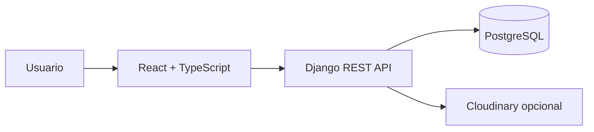

# Dynamo

Dynamo es una aplicación web mobile-first para registrar entrenamientos, rutinas, peso corporal y progreso en el gimnasio.

La hice porque durante los entrenamientos muchas veces no recordaba cuánto peso había usado o cuántas repeticiones había hecho la sesión anterior. La idea inicial fue poder consultar rápidamente el último registro y saber si realmente estaba progresando.

## Qué permite hacer

- Registrar entrenamientos, ejercicios, series, repeticiones y peso.
- Consultar el historial y editar o eliminar series.
- Crear rutinas y reutilizarlas para empezar una sesión.
- Compartir rutinas por enlace y guardarlas en otra cuenta.
- Consultar un catálogo de ejercicios con nombres e instrucciones en español.
- Crear ejercicios personalizados.
- Registrar el peso corporal y fotos de progreso.
- Ver métricas por ejercicio, volumen, mejor peso y 1RM estimado.
- Seguir personas, ver actividad, enviar mensajes y desbloquear logros.
- Compartir publicaciones, comentarios y reacciones en la comunidad.

## Por qué lo hice

Dynamo empezó como una herramienta personal para resolver una necesidad concreta: recordar lo que había hecho en el gimnasio y comparar sesiones sin depender de la memoria. Con el tiempo incorporé rutinas, seguimiento de peso, métricas, actividad entre amigos, logros y notificaciones.

## Tecnologías

### Frontend

- React 18
- TypeScript
- Vite
- React Router
- TanStack Query
- Recharts
- Lucide React

### Backend y datos

- Python 3.12
- Django 5
- Django REST Framework
- PostgreSQL
- pytest y pytest-django

### Infraestructura

- Docker y Docker Compose
- Nginx para servir el frontend compilado
- Render para el despliegue descrito en `render.yaml`
- GitHub Actions para lint, tests y build
- Cloudinary opcional para imágenes; el backend conserva un fallback local

## Arquitectura

La aplicación está organizada como una SPA de React y una API REST de Django. PostgreSQL almacena los datos; las imágenes pueden guardarse en Cloudinary cuando está configurado.



El backend separa responsabilidades en las apps `users`, `exercises`, `workouts`, `bodymetrics`, `progress` y `social`. Los entrenamientos, rutinas y métricas privadas se consultan asociados al usuario autenticado.

## Algunas decisiones técnicas

### Datos privados por usuario

Las entidades expuestas usan UUID y las consultas de entrenamientos, rutinas, peso y progreso se filtran por el usuario autenticado. También hay tests de aislamiento para evitar que una cuenta acceda a los datos de otra.

### Métricas calculadas desde las series

El volumen se calcula como `peso × repeticiones` y solamente cuenta series completadas. El 1RM estimado utiliza la fórmula de Epley (`peso × (1 + repeticiones / 30)`). Los datos se calculan a partir de las series, sin guardar estadísticas redundantes.

### Catálogo idempotente

El comando `import_exercises` importa el dataset [free-exercise-db](https://github.com/yuhonas/free-exercise-db), conserva el identificador externo y actualiza los registros existentes en lugar de duplicarlos. También prepara nombres e instrucciones en español.

### Autenticación

Se puede ingresar con email y contraseña o con Google Identity Services cuando se configura `GOOGLE_CLIENT_ID`. Django valida la credencial de Google y emite una sesión y un token para la API. El token se revoca al cerrar sesión.

## Ejecutar localmente

La forma recomendada es usar Docker Compose:

```bash
git clone https://github.com/deadour/dynamo.git
cd dynamo
cp .env.example .env
docker compose up --build
```

La aplicación queda disponible en `http://localhost:5173`. La API responde en `http://localhost:8000`, con documentación OpenAPI en `/api/docs/` y controles de salud en `/health/` y `/readiness/`.

Para importar el catálogo manualmente:

```bash
cd backend
python manage.py import_exercises
```

También existe `python manage.py seed_dev` para crear datos de demostración en un entorno local. No se incluyen credenciales reales en el repositorio.

## Variables de entorno

Copiá `.env.example` a `.env` para desarrollo. Las variables más importantes son:

- `DJANGO_SECRET_KEY`, `DEBUG` y `DATABASE_URL`.
- `ALLOWED_HOSTS`, `CORS_ALLOWED_ORIGINS` y `CSRF_TRUSTED_ORIGINS`.
- `GOOGLE_CLIENT_ID` para habilitar el ingreso con Google.
- `CLOUDINARY_CLOUD_NAME`, `CLOUDINARY_API_KEY` y `CLOUDINARY_API_SECRET` para almacenamiento externo de imágenes.

Los archivos `.env` están ignorados por Git. Los valores del ejemplo son placeholders para uso local.

## Tests y calidad

Desde la raíz se pueden ejecutar:

```bash
make test
make lint
```

Los comandos individuales son:

```bash
cd backend && pytest -q
cd frontend && npm run test -- --run
cd frontend && npm run lint
cd frontend && npm run build
```

La integración continua ejecuta `python manage.py check`, verifica migraciones, corre los tests de backend y valida lint, tests y build del frontend.

## Estado

Dynamo es un proyecto personal funcional que continúa evolucionando. La base de registro de entrenamientos, rutinas, peso y progreso está implementada, junto con funciones sociales y una configuración reproducible para desarrollo y despliegue. La autenticación de Google y el almacenamiento de imágenes requieren configurar sus variables de entorno correspondientes.
